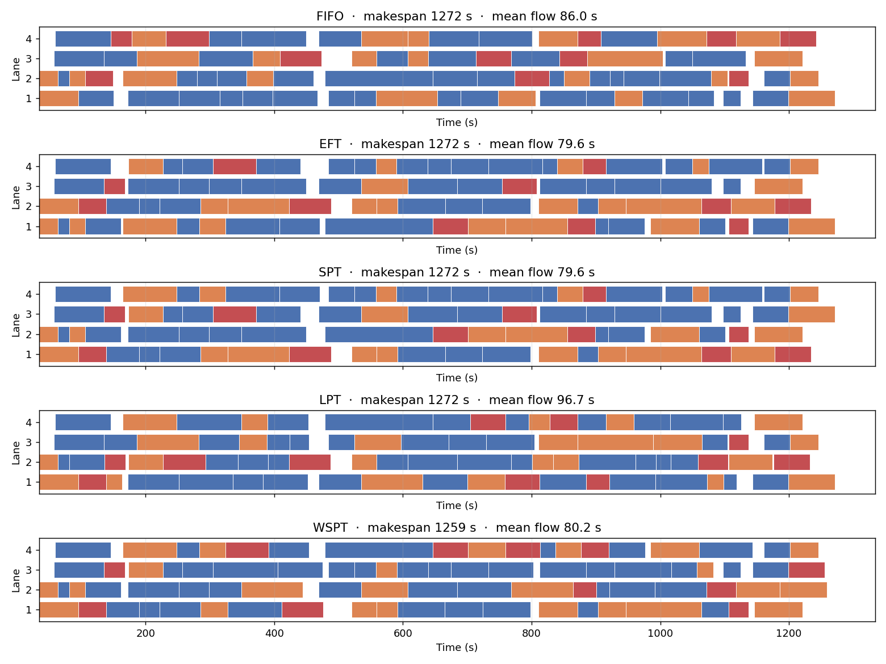
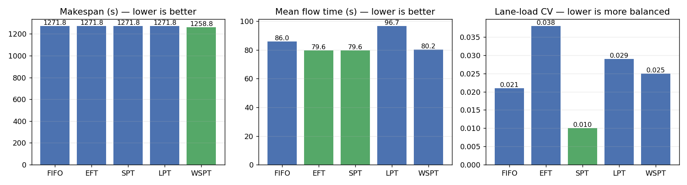

# Warehouse Conveyor Scheduling Optimizer

**[Live demo](https://mason-warehouse-conveyor-scheduling.streamlit.app/)** : runs in the browser, no install required.

A parallel-machine scheduling system for **tote sequencing across a multi-lane
warehouse conveyor**. Implements five classical dispatching rules from
scheduling theory (**FIFO**, **EFT**, **SPT**, **LPT**, **WSPT**) and
benchmarks them on a congested-rush-hour workload of 80 totes against
4 lanes. The same library powers a Jupyter walkthrough and an interactive
Streamlit dashboard with editable tote tables and a live Gantt chart.



## The problem

Each tote arriving at the dispatch point has:

| Attribute | Meaning |
|---|---|
| `release_time_s` | When the tote becomes available for processing |
| `processing_time_s` | How long any lane takes to handle it |
| `priority` (1 – 3) | Operational urgency : used by WSPT |
| `grade` | Standard / Express / Fragile : display category |

When a lane frees up, the dispatcher must choose **which waiting tote it
takes next**. Different rules optimise different objectives.

## The five rules

| Rule | Decision | Optimises |
|---|---|---|
| **FIFO** | Take the oldest waiting tote (baseline) | Fairness |
| **EFT** | Pick the (tote, lane) pair that minimises finish time | Local greed |
| **SPT** | Among ready totes, take the shortest | Mean flow time |
| **LPT** | Among ready totes, take the longest | Makespan with non-zero releases |
| **WSPT** | Largest priority/processing ratio (Smith's rule) | Weighted flow time |

## The bundled workload

`build_dataset.py` generates a realistic rush-hour workload:

| Parameter | Value |
|---|---:|
| Totes | 80 |
| Lanes | 4 |
| Arrival window | 0 – 1,500 s (~25 min) |
| Processing time | lognormal, mean 60 s, max ~170 s |
| Priority distribution | 60 % p=1, 30 % p=2, 10 % p=3 |
| Grade distribution | 65 % Standard, 25 % Express, 10 % Fragile |

Total work ≈ 4,500 s : meaningfully more than the 1,500 s arrival window,
so the lanes queue and dispatching choices actually matter.

## Results on the bundled workload

| Rule | Makespan (s) | Mean flow (s) | Mean wait (s) | Lane balance (CV) |
|---|---:|---:|---:|---:|
| FIFO | 1,272 | 86.0 | 28.9 | 0.021 |
| EFT | 1,272 | 79.6 | 22.5 | 0.038 |
| SPT | 1,272 | 79.6 | 22.5 | **0.010** |
| LPT | 1,272 | 96.7 | 39.5 | 0.029 |
| **WSPT** | **1,259** | 80.2 | 23.1 | 0.025 |



- **WSPT** delivers the lowest makespan by exercising the priority lever.
- **SPT** and **EFT** tie for lowest mean flow time.
- **LPT** is *worst* on flow time (long jobs hog lanes early), but the
  textbook recommendation when only makespan matters and releases are
  non-zero.
- **SPT** also delivers the most balanced lane utilisation.

## Repository layout

```
.
├── conveyor_scheduling.ipynb       ← walkthrough notebook with Gantt charts
├── conveyor_scheduling_app.py      ← Streamlit dashboard (editable totes + live Gantt)
├── scheduling.py                   ← scheduler library (FIFO/EFT/SPT/LPT/WSPT)
├── build_dataset.py                ← regenerate the bundled workload
├── conveyor_data.xlsx              ← 80-tote sample workload
├── rule_comparison.png, gantt_comparison.png, gantt_wspt.png   ← figures
├── requirements.txt
└── README.md
```

## Run it

### Notebook walkthrough

```bash
pip install -r requirements.txt
python build_dataset.py            # regenerate the bundled workload
jupyter notebook conveyor_scheduling.ipynb
```

### Interactive dashboard

```bash
streamlit run conveyor_scheduling_app.py
```

The dashboard:

- **Editable tote table** : change release times, processing times,
  priorities, grades; add or delete rows. The Gantt re-renders on every
  edit.
- **Lane count slider** : set 1 – 12 lanes and see how throughput scales.
- **Rule selector** : switch between FIFO / EFT / SPT / LPT / WSPT and
  watch the schedule rearrange.
- **Side-by-side Gantt** : every rule rendered in one stack so the
  trade-offs are visible at a glance.
- **Per-tote schedule download** : export the chosen rule's full schedule
  as CSV.

### Programmatic use

```python
from scheduling import load_totes, RULES, compare_rules

totes, n_lanes = load_totes("conveyor_data.xlsx")
print(compare_rules(totes, n_lanes))

best = RULES["WSPT"](totes, n_lanes)
print(f"WSPT makespan: {best.makespan:.0f} s")
print(best.to_dataframe().head())
```

## Stack

Python · pandas · NumPy · matplotlib · openpyxl · **Streamlit** (dashboard)
